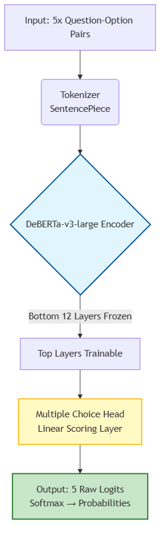
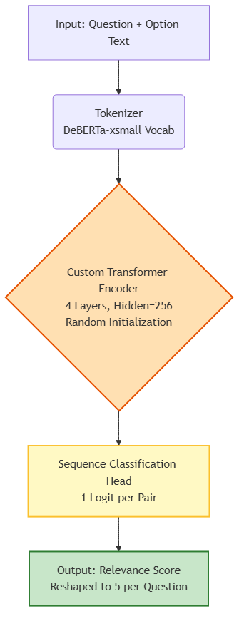
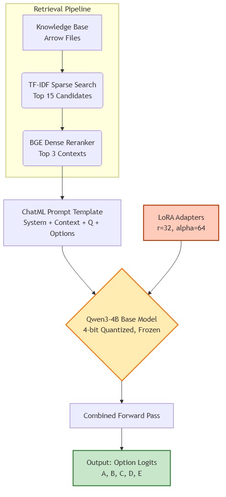
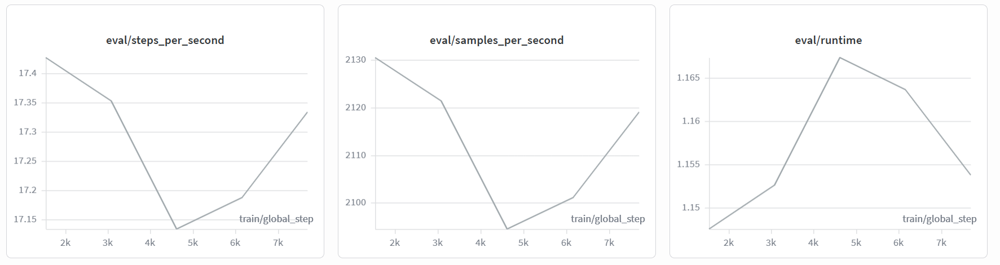
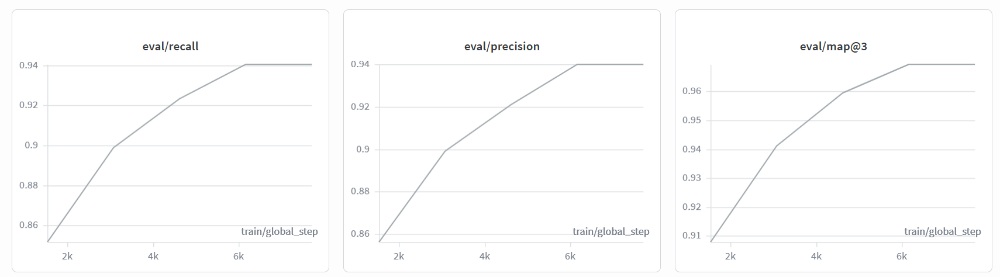
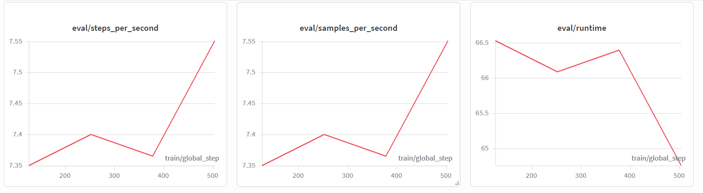
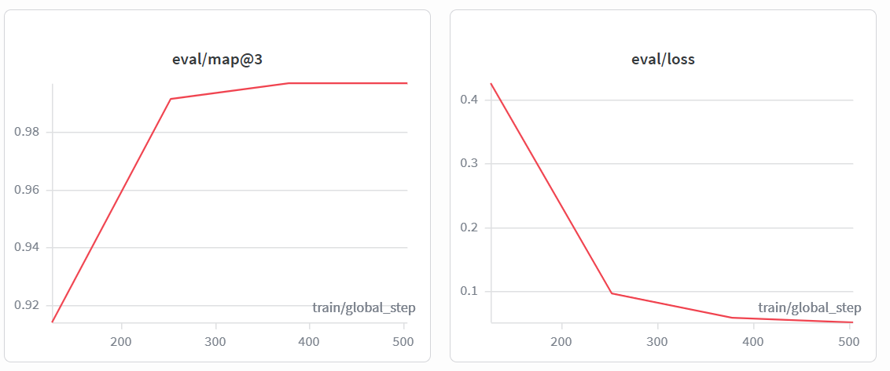
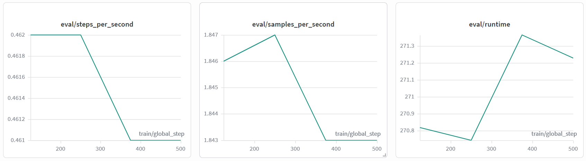
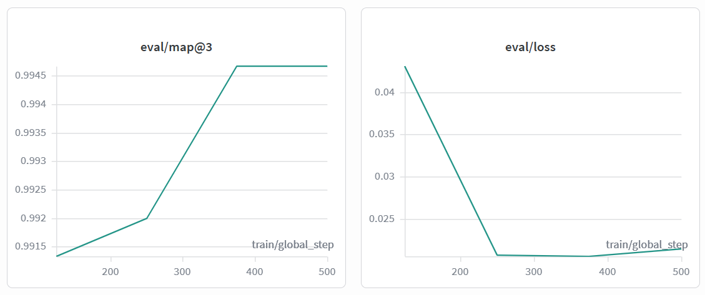
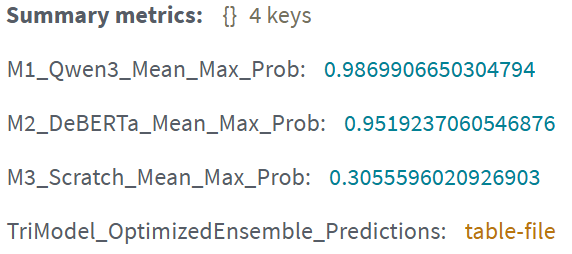

# MCQ Ensemble Implementation Report

1. Abstract

This project addresses the MCQ Solver Challenge on Kaggle, where the task is to rank the top 3 most likely correct options (A-E) for a given question prompt. The evaluation metric is mAP@3 (Mean Average Precision at 3). Three distinct models were developed and trained using 5-fold cross-validation: a fine-tuned DeBERTa-v3-large encoder, a lightweight Transformer built from scratch, and a Qwen3-4B decoder augmented with a Retrieval-Augmented Generation (RAG) pipeline and fine-tuned via LoRA. Predictions were combined using a custom confidence-gated ensembling strategy. The final ensemble achieved a public leaderboard mAP@3 score of 0.75768, outperforming any single model.

2. Introduction & Dataset

2.1 Problem Statement & Objective

The dataset consists of short, factual, science-style questions. The training set contains 2,000 rows with a balanced distribution of answer labels (A-E), and the public test set contains 500 rows. The objective was to build a reproducible, end-to-end pipeline comparing a large fine-tuned encoder, a from-scratch model, and a RAG-augmented decoder, ultimately combining them to maximize reliability and mAP@3 performance.

2.2 Preprocessing & Tokenization Strategy

Preprocessing involved mapping answer letters (A-E) to numeric labels (0-4) and unifying the question field. No traditional data augmentation was used; instead, external context was injected via RAG. Three tokenizers were employed: DeBERTa-v3-large’s SentencePiece tokenizer (primary), a reused DeBERTa-v3-xsmall vocabulary for the scratch model, and Qwen3-4B’s byte-level BPE tokenizer with ChatML formatting. The DeBERTa-v3 tokenizer utilizes a subword algorithm, which is highly effective for scientific terminology by breaking rare words into known sub-components rather than defaulting to an unknown token. For the multiple-choice setup, tokenization operates in sentence-pair mode, inserting special separator tokens between the question and each candidate option. Dynamic batch padding is employed via a custom data collator, ensuring sequences are only padded to the length of the longest sequence in the current batch, significantly reducing unnecessary computational overhead compared to static max-length padding.

3. Modeling & Experimentation

3.1 Model 1: DeBERTa-v3-large (Encoder)

Model Repository: [private model repository omitted] on microsoft/deberta-v3-large using AutoModelForMultipleChoice. Fine-tuned with 8-bit AdamW, peak learning rate 8e-6, 4 epochs, and 5-fold StratifiedKFold. The bottom 12 encoder layers were frozen to preserve general language understanding, while upper layers were adapted. Adversarial Weight Perturbation (AWP) was applied to the word embedding layer after the first epoch. This regularization technique nudges the embedding weights in the direction that maximizes the loss, computes a secondary loss on this perturbed state, and utilizes that gradient signal before restoring the original weights, enhancing model robustness and mitigating overfitting. Inference utilized float16 precision for efficiency.

The key architectural feature that makes DeBERTa particularly suitable for this multiple-choice task is its disentangled self-attention mechanism. Unlike standard Transformer models that use a single attention score combining content and position, DeBERTa represents each token's content and relative position as two separate vectors. This allows the model to independently learn how much attention to pay based on the semantic meaning of the words versus their structural placement in the sentence. When comparing a single question prompt against five distinct, and often similarly-worded, candidate options, this fine-grained attention control helps the encoder capture subtle relational nuances that standard BERT-based models might overlook.

Figure 1: Architecture and data flow of the fine-tuned DeBERTa-v3-large multiple-choice encoder.

3.2 Model 2: Custom Scratch Transformer

Model Repository: [private model repository omitted] deliberately small architecture (4 layers, 256 hidden size, 4 attention heads, 1024 FFN) initialized with random weights to provide architectural diversity for the ensemble. Trained with AdamW (lr 1e-4), 5 epochs, batch size 64, and mixed-precision (fp16) across 5 folds. Since this model is trained entirely from the competition's own data, its mistakes tend to be fundamentally different from the mistakes made by large pretrained models, which is exactly the kind of diversity an ensemble benefits from.

Figure 2: Architecture of the lightweight custom Transformer trained entirely from random initialization.

3.3 Model 3: Qwen3-4B + RAG (Decoder)

Model Repository: [private model repository omitted] decoder-only causal language model loaded in 4-bit quantization via Unsloth. A two-step RAG pipeline was implemented: a fast TF-IDF sparse search shortlisted the top 15 passages, followed by dense re-ranking using BAAI/bge-small-en-v1.5 to select the top 3 contexts. This hybrid approach balances the speed of sparse retrieval with the semantic accuracy of dense embeddings. The model was fine-tuned using LoRA (r=32, alpha=64, dropout=0.05) targeting attention and FFN projection layers, preserving the base model's general knowledge while adapting to the MCQ format with a batch size of 4 and gradient accumulation of 4.

Figure 3: End-to-end pipeline of the hybrid RAG retrieval system feeding into the 4-bit quantized Qwen3-4B decoder with LoRA adapters.

Choosing a decoder-based generative language model for the third architecture, rather than a traditional sequence-labelling Recurrent Neural Network (RNN), allowed for the seamless integration of Retrieval-Augmented Generation within a conversational prompt structure. Because decoder models process and generate text autoregressively in a chat-style format, external context passages can be injected directly into the system or user prompt alongside the question and options. Furthermore, a specialized masking strategy was employed during the LoRA fine-tuning phase. The cross-entropy loss was calculated exclusively on the tokens representing the correct answer letter. All preceding tokens, including the system instructions, retrieved context, question prompt, and candidate options, were assigned a label of -100. This ensures the model is only penalized for failing to predict the correct option and is not unnecessarily penalized for predicting the input context it was already provided.

4. Performance & Comparative Analysis

4.1 Comparative Metrics

4.2 Ensembling Result

The ensembling strategy is designed to be dynamic and confidence-aware. Each model's 5-fold predictions are averaged, then undergo power-scaling sharpening (raising probabilities to a power > 1 and renormalizing) to accentuate the top choice. These are also converted into scale-invariant percentile ranks. The blending weights are determined by the prediction margin of the DeBERTa model. When DeBERTa's top-two margin is high (≥0.35), it receives a weight of 0.82. For medium margins (≥0.15), the weight drops to 0.62, allocating more influence to the Scratch (0.23) and Qwen3 (0.15) models. When DeBERTa is uncertain (<0.15), the ensemble relies more heavily on the diverse perspectives of the Scratch (0.34) and Qwen3 (0.24) models. Final Ensembled mAP@3 (Public Leaderboard): 0.75768. (Private scores and ranks are omitted as they are pending).

The mathematical foundation of the ensemble relies on two distinct transformations applied to the raw fold-averaged probabilities: power-scaling sharpening and percentile ranking. Sharpening involves raising each model's probability distribution to a power greater than 1 and subsequently renormalizing the vector so it sums to 1. This non-linear transformation accentuates the model's top choice, pushing it further ahead of the secondary options and reducing the influence of low-confidence noise. Concurrently, the distributions are converted into scale-invariant percentile ranks, which map the raw probabilities to a uniform 0.0 to 1.0 scale based on their relative standing. By blending both the sharpened probabilities and the percentile ranks, the final ensemble leverages the absolute confidence of the models while remaining robust to situations where one model's raw probability scale is poorly calibrated compared to the others.

4.3 Experiment Tracking (Weights & Biases)

All training loss curves, evaluation metrics, and inference logs are tracked in Weights & Biases:

Scratch Model (Total: 1hr 15m | Infer: 45s): Inference | Folds: 1, 2, 3, 4, 5

DeBERTa-v3 (Total: 13hr 5m | Infer: 3m 55s): Inference | Folds: 1, 2, 3, 4, 5

Qwen3-4B (Total: 18hr 45m | Infer: 43m): Inference | Folds: 1, 2, 3, 4, 5

Final Ensemble Inference (Total: 35 mins): Ensemble Run

5. Conclusion, Challenges & Future Work

5.1 Key Learnings

This project successfully demonstrated the full modern NLP/GenAI toolchain. Key learnings include: (1) Freezing lower layers of large encoders is a practical fine-tuning strategy that preserves general language understanding while adapting to specific tasks. (2) Training a small model from scratch provides valuable, uncorrelated error patterns for ensembling, highlighting the immense value of pretraining. (3) LoRA combined with 4-bit quantization makes multi-billion parameter decoder fine-tuning feasible on limited hardware. (4) A two-stage sparse-to-dense retrieval pipeline efficiently adds external knowledge to a language model's prompt. (5) Confidence-gated ensembling reliably outperforms single models by dynamically adjusting weights based on prediction certainty.

5.2 Challenges Faced

Challenges included aggressive GPU memory management across diverse model sizes, which was solved via batch size tuning, gradient checkpointing, mixed precision, and 4-bit quantization. Ensuring RAG context relevance required the two-stage sparse-to-dense retrieval pipeline, as single-method retrieval often returned broadly related but ultimately unhelpful passages. Finally, deciding ensemble weights required a confidence-gated blending approach, as the best-performing model is not equally confident on every question.

5.3 Areas for Future Work

Future improvements could involve expanding or replacing the knowledge base with a more topic-specific source to improve RAG accuracy. Systematically searching or learning the ensemble's confidence-margin thresholds (0.35 and 0.15) from validation data could further optimize the final blended score. Additionally, exploring a fourth, sequence-based model (such as an LSTM or GRU) could provide further architectural diversity to the ensemble.

6. References & Deployment

Devlin, J. et al. (2018). BERT: Pre-training of Deep Bidirectional Transformers. arXiv:1810.04805.

He, P. et al. (2021). DeBERTaV3: Improving DeBERTa using ELECTRA-Style Pre-Training. arXiv:2111.09543.

Hu, E. J. et al. (2021). LoRA: Low-Rank Adaptation of Large Language Models. arXiv:2106.09685.

Qwen Team. Qwen3 Technical Report (Qwen/Qwen3-4B-Instruct-2507), Hugging Face Hub.

Unsloth AI. Documentation for memory-efficient LoRA fine-tuning and 4-bit model loading.

Reimers, N. & Gurevych, I. (2019). Sentence-BERT. Used via BAAI/bge-small-en-v1.5.

Kaggle. MCQ Solver Challenge: [benchmark URL omitted] Deployment: The model ensemble is deployed on Hugging Face Spaces, allowing users to input questions and options to receive individual model probabilities and the final ensemble Map@3 prediction: [private deployment URL omitted]

## Figures

